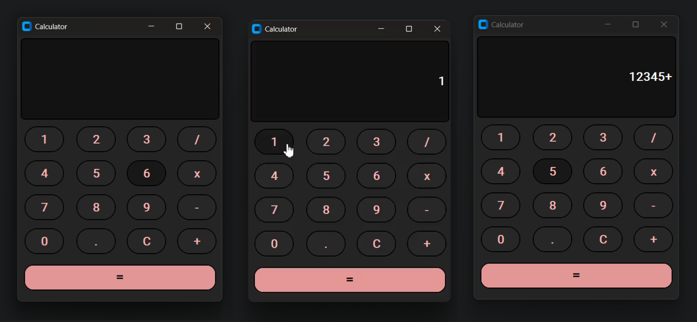

# Calculator Application

A simple and user-friendly arithmetic calculator built with Python and CustomTkinter. 

 

 

## Overview

This application provides basic arithmetic operations (+, -, \*, /) in a clean graphical interface, suitable for everyday calculations.

## Features

*   Addition, subtraction, multiplication, and division.
*   Clear input field.
*   User-friendly interface.
*   *(Optional: Responsive design, Cross-platform compatibility)*

## How to Run

1.  Clone: `git clone [https://github.com/ArchanaAthmanathan/Calculator.git](https://github.com/ArchanaAthmanathan/Calculator.git)`
2.  `cd Calculator`
3.  `python3 -m venv .venv` (or `python -m venv .venv` on Windows)
4.  Activate: `.venv\Scripts\activate` (Windows) or `source .venv/bin/activate` (macOS/Linux)
5.  `pip install -r requirements.txt`
6.  `python calculator/main.py`

## How to Build (Optional)

1.  `pip install pyinstaller`
2.  `python build.py`
3.  Executable in `dist` folder.

## Dependencies

*   Python 3.x
*   CustomTkinter

## License

MIT License - see [LICENSE](LICENSE)

## Author

Archana Athmanathan

## Acknowledgements

CustomTkinter: [https://github.com/TomSchimansky/CustomTkinter](https://github.com/TomSchimansky/CustomTkinter)

## Contributing

Contributions welcome! Open an issue or submit a pull request.

## Contact

arc1stmail@gmail.com